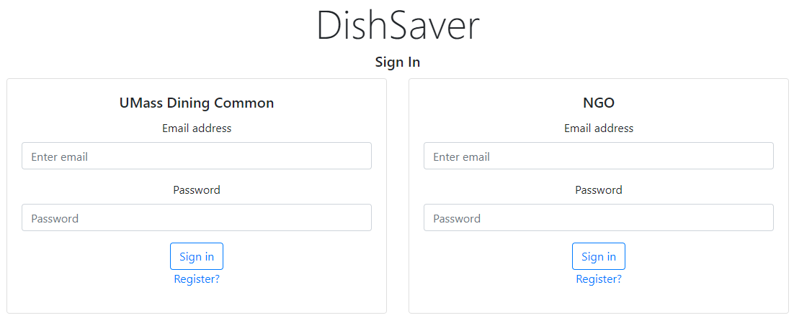
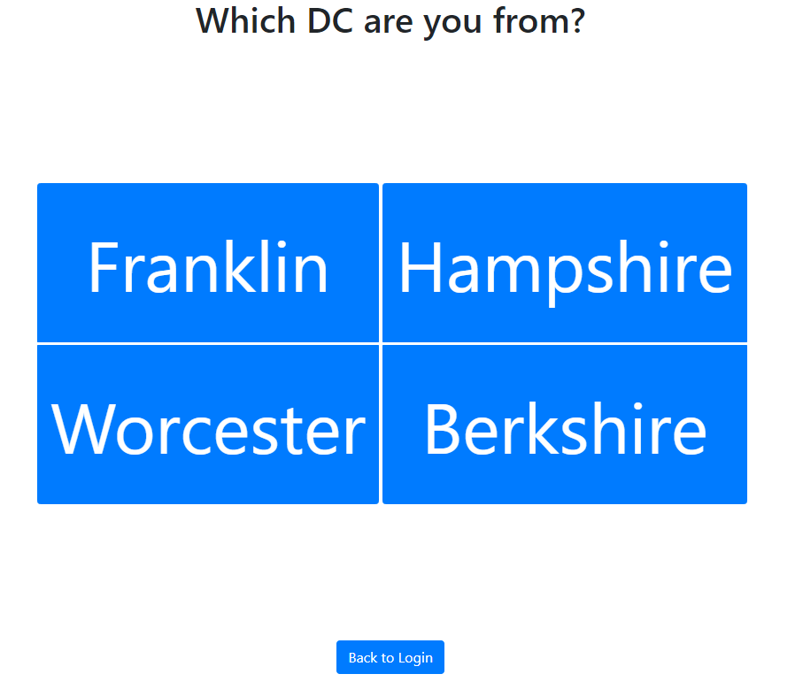
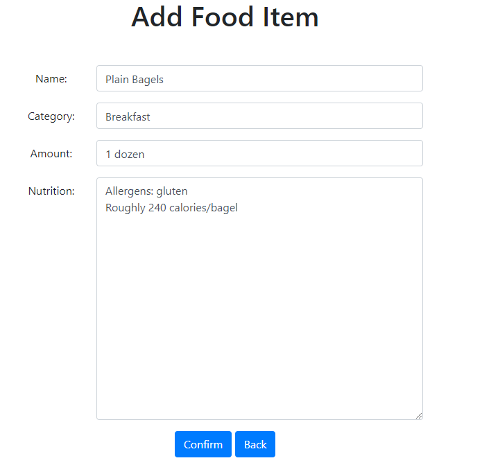
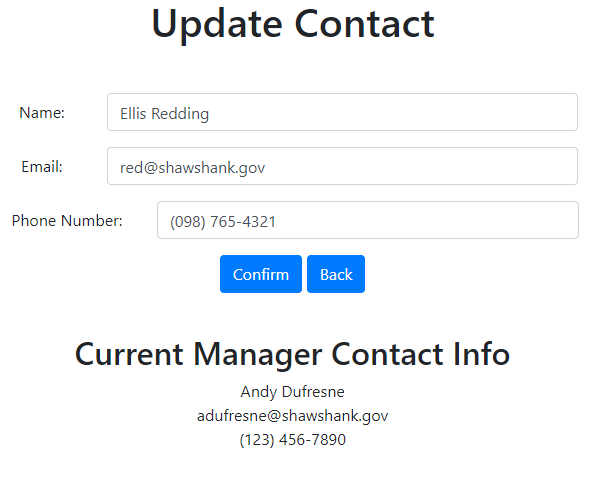
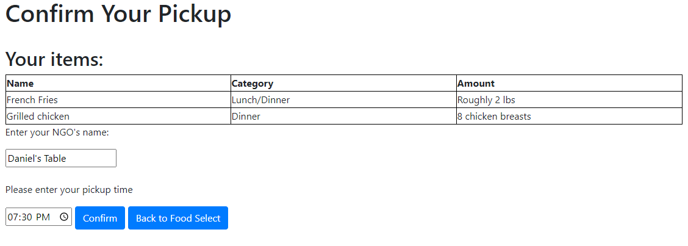

## Title: Chi Team

## Subtitle: DishSaver

## Semester: Fall 2020

## Overview:
DishSaver allows UMass Dining Commons to easily and effectively communicate with NGO's (non-governmental organizations, also known as nonprofit organizations) about donating leftover food so that it may help those in needs rather than being wasted. This application allows DC's to put up food that is available, and then NGO's may request to take whichever items they choose. DishSaver is an innovative application because there are no mainstream/popular applications similar to it and it helps to simplify and automate an existing task.

## Team Members:
* Alex Hickey, GitHub: alexhickey09
* Alex Preston, GitHub: alexp367
* Roshan Shetty, GitHub: RoshanPShetty

## User Interfaces:
### Sign in/Register

Allows existing users to sign in to the application or new users to register an account (the signin UI is pictured above but the register UI looks very similar).

### DC Home Page

The DC Home Page UI allows DC employees to select which DC they work at.

### NGO Home Page

The NGO Home Page UI allows NGO's to select which DC they would like to view.

### Add Food

This UI lets DC's make a leftover food item available to NGO's. Information they may provide are: Name of food, Category of food (can be meal such as breakfast or type of food such as vegetable), Amount (by quantity, weight, portions, etc.), and Nutritional Information.

### Update Contact

Allows the DC to update their contact information so the NGO's may reach them with any inquiries they may have.

### Select Food

Allows NGO's to select whichever food items they want. They can also see the contact info for the DC they selected on this screen.

### Pickup Confirmation

Allows NGO's view all of the items they have selected and prompts them to enter the name of their NGO as well as the time they will pick up the food. In the example picture, the user selected "French Fries" and "Grilled chicken" from the available foods shown in the 'Select Food' example screenshot.

### Requests

Allows DC's to view all current requests that have been made. Once an NGO has picked up their requested food, the DC may click the fulfill button to remove the request from the table. 

## APIs
* `/login` allows users to login   
* `/register` allows new users to signup
* `/addfood` posts a new food for the given DC, including, the following information for the food: name, category, amount, nutritional information
* `/viewfood` shows all available food for the selected DC
* `/updatecontact` updates the contact info for the selected DC
* `/viewcontact` views the contact info for the selected DC
* `/addToSelection` adds the selected food to the list of food for the current request, or the "cart"
* `/selectedFood` gives all of the food in the current selection, or "cart"
* `/makeRequest` confirms the current selection and makes it a request. This takes the NGO's: name, time of pickup, food items chosen. This also removes all of the chosen food from the DC's list of available food to prevent multiple NGO's from selecting the same food.
* `/fulfillRequest` completes/removes the selected request
* `/viewrequests` shows all current requests at the selected DC

## Database:
* We used a MongoDB cluster and created a database which has 5 collections: `contact`, `food`, `selection`, `requests`, and `users`.
* Below is a brief description of each collection, including what an entry within each collection consists of and the relationships between collections/entries. Also included an example/prototype entry for each collection.
  
### Contact:
    * Stores the contact information for the Dining Commons.
    * Format: Name, Email, Phone.
    * Example:
      contact document { 
          _id: <Object ID>
          name: String, //Name of contact
          email: String, //Email of contact
          phone: String, //Phone number of contact
          dc: String //DC at which contact works
      }
    * Relationships: None.
### Food:
    * Stores information about each food item available.
    * Format: Name, Category, Amount, Nutrition, DC.
    * Example:
      food document { 
          _id: <Object ID>
          name: String, //Name of food
          category: String, //Category of food (breakfast, dinner, ...)
          amount: String, //Quantity of food available
          nutrition: String, //Nutritional information for food
          dc: String //DC at which food is available
      }
    * Relationships: Food items are converted into a selection entry once an NGO selects them.
### Selection:
    * Stores the user's current selection (similar to a checkout cart).
    * Format: Array of food items containing Name, Category, Amount.
    * Example:
      selection document { 
          _id: <Object ID>
          name: String, //Name of food item
          category: String, //Category of food (breakfast, dinner, ...)
          amount: String, //Quantity of food available
      }
    * Relationships: Selection takes entries from food once an NGO selects an item. A selection is converted to a request, along with the NGO's name and pickup time, once an NGO confirms their selection.
### Requests:
    * Stores the info about the ngo and pickup as well as the food being taken.
    * Format: Name, Time, Food Array, DC
    * Example:
      contact document { 
          _id: <Object ID>
          name: String, //Name of the NGO making the request
          time: String, //Time the NGO will pickup their food
          foods: Array, //Array containing the names of all the food the NGO has selected
          dc: String //DC for which the NGO is making a request
      }
    * Relationships: Requests are formed from a selection, along with the NGO's name and pickup time, once an NGO confirms their selection.
### Users:
    * Stores the email and password of registered users.
    * Format: Email, Password Array
    * Example:
      contact document { 
          _id: <Object ID>
          username: String, //Email of the registered user
          password: Array //Containing the encrypted salt and hash of the password
      }
    * Relationships: None.

## URL Routes/Mappings:
Using the wireframe from milestone 1, we can see a general outline for the URL routes:

The application opens with `index.html`, which is the signin page. You may choose to sign in if you already have an account or register an account if you do not already have one. The routes for sign up are:

`index.html` -> `signup.html` -> `index.html`

From the signin page, there are two main routes a user may take: NGO and DC:

#### NGO:

If you choose to sign in as an NGO, the routes are as follows:

`index.html` -> `ngo-choose-dc.html` -> `ngo-select-food.html` -> `ngo-confirmation.html`

The routes imply that after signing in, you first choose the dc you would like to view, then you select the food that you would like to take, and then you confirm the details and confirm your request. The naming of the html files describes their purpose.

#### DC:

If you choose to sign in as a DC, the routes are as follows:

`index.html` -> `dc-home.html`

After logging in, you choose which DC you currently work at. From the DC Home screen, users may take the following routes, in any order and as many or as few times as they wish:

##### Route 1: Adding foods
In this route, the DC user adds the food that they have available for the NGO's to take:
`dc-todaysfood.html` -> `dc-add.html` -> `dc-todaysfood.html`

##### Route 2: Viewing and Fullfilling requests
In this route, the DC user may view all requests that have been made from NGO's and may remove/clear requests once they have been completed:
`dc-todaysfood.html` -> `dc-requests.html` -> `dc-todaysfood.html`

##### Route 3: Updating Contact
In this route, the DC user view and update their contact info so NGO's can reach them:
`dc-todaysfood.html` -> `dc-update.html` -> `dc-todaysfood.html`

## Authentication/Authorization:
Users register an account with their email and password.
Users choose whether they are from a DC or NGO when logging in or registering. Based on that choice they will be directed to the home page for either DC's or NGO's and be able to access all subsequent pages based on which side they logged in to. DC users will be able to see all pages that start with 'DC' and NGO users will be able to see all pages that start with 'NGO'.
User passwords are encryptes using MiniCrypt that was given in class.

## Division of Labor:
Alex Hickey: Wrote milestone1.md, made a draft of the wireframe, created the following html pages: ngo-choose-dc, ngo-confirmation, ngo-select-food. Did general cleanup/beautification on many other pages. Added html file pictures and made GitHub release, Setup Heroku deployment. Setup page navigating/rerouting. Wrote the back-end server endpoints as well as front-end implementation for the following API endpoints: addfood, updatecontact, viewfood, viewcontact, addToSelection, makeRequest, viewrequests, fulfillRequest, Connected MongoDB and implemented all server endpoints using MongoDB. Implement register and login functionality with MongoDB. Help with adding one contact info per DC. General QOL + stylistic improvements. Add example documents for MongoDB collections in milestone3.md, worked on final.md.

Alex Preston: Made edits to interactions between users and data, made a draft of the wireframe as well as the final, created all dc.html pages, looked over all pages and made minor changes, Made milestone2 doc and added endpoints and screenshots to it. Added skeleton of endpoints to server.js, implemented some endpoints, helped with various js making use of endpoints for functionality, Setup Login and Sign Up functionality, created and filled out milestone3.md, created final.md and added link, updated setup.md, worked on final.md. 

Roshan Shetty: Made a draft of the wireframe, initially made all html files, created signin, signup, ngo-food-list html files, helped with various js making use of endpoints for functionality, made certain changes to the html files, setup.md, and milestone2.md, setup the multi dc, multi contact, and multi request functionality for the dc and ngo sides. Made changes to milestone3.md, worked on final.md.

## Conclusion:
The goal of the application was to provide simple communication between UMass Dining Commons (DC's) and nonprofit organizations (NGO's) to allow the NGO's to pick up leftover food from the DC's so the food goes to those in need, rather than being wasted. This was achieved by allowing each DC to list the food they have leftover at the end of each day/meal (including quantities, nutrional & allergen information, etc.) and NGO's specifying which food they are interested in picking up from which DC and when they will pick the food up. \
Once an NGO selects a food item, it is no longer displayed to the other NGO's in order to prevent double booking. 
With our project finished, we can say that we have successfully built our application that achieves this goal. 